# lysispeptica_thesis_plot
Generating images for the LysisPeptica thesis, helping visualize concepts and results efficiently.

---

  

* main flowchart of LysisPeptica ensemble model 
* img path: /others/main_concept2.png 
* was plotted by ppt

---

  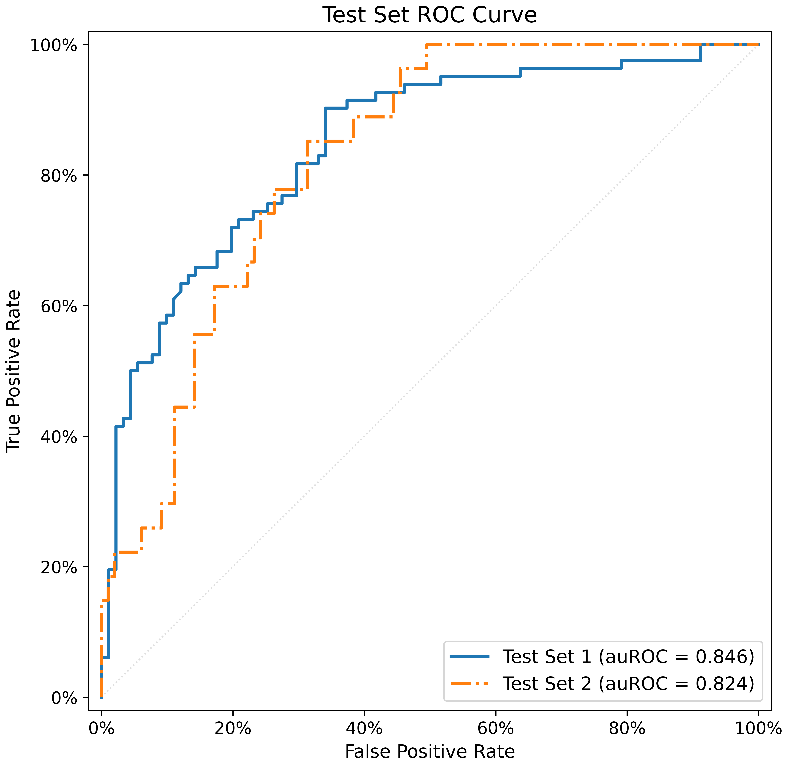

* overlapped ROC of two test sets 
* img path: /test_set/ROC_plot/testsets_roc.png 
* was plotted by /test_set/ens_plot.py

---

  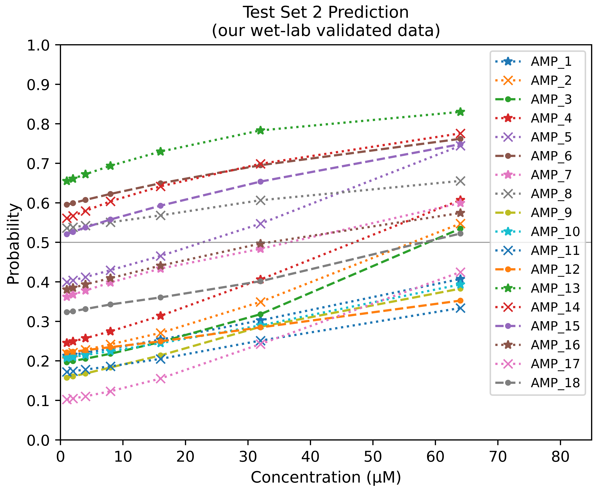

* test set 2 linegraph across different concentration level (1,2,4,8,16,32,64 繕M)
* img path: /t2_property/img_output/t2_ens.png
* was plotted by /t2_property/t2_linegraph.py

---

  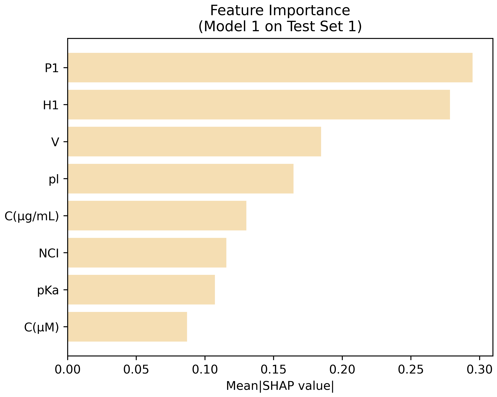

* SHAP value (feature importance analysis) of model 1 in test set 1
* img path: /models/m1_791_836_cnn_zs_5544/shap_img/md1_t1.png
* was plotted by /xAI_shap/modify_png.py

---

  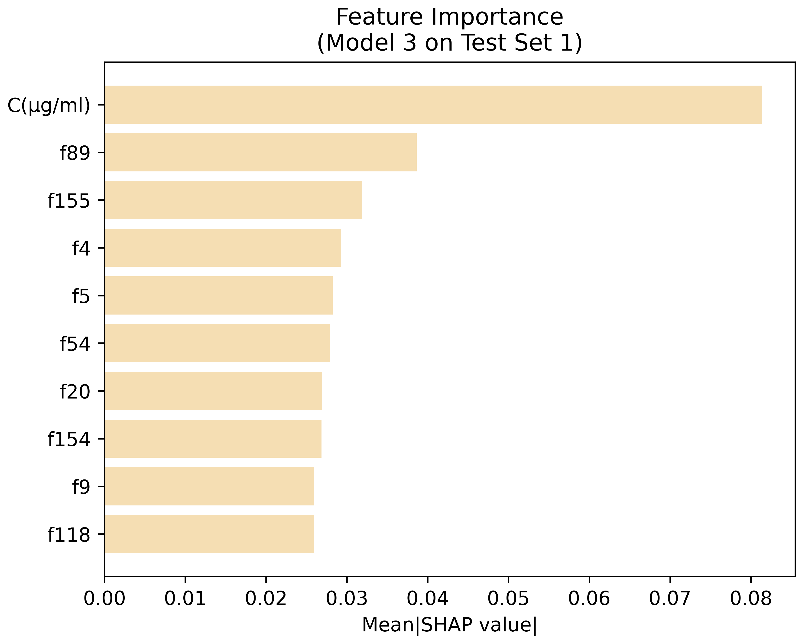

* SHAP value (feature importance analysis) of model 3 in test set 1
* img path: /models/m3_763_843_5950_3p1bn_ugml2std/shap_img/md3_t1.png
* was plotted by /xAI_shap/modify_png.py

---
### Other SHAP plots

* Image Path: 

|        | test set 1 | test set 2 |
|--------|------------|------------|
| model1 | /models/m1_791_836_cnn_zs_5544/shap_img/md1_t1.png | /models/m1_791_836_cnn_zs_5544/shap_img/md1_t2.png |
| model2 | /models/m2_798_796_cnn2_zs_5545/shap_img/md2_t1.png    | /models/m2_798_796_cnn2_zs_5545/shap_img/md2_t2.png    |
| model3 | /models/m3_763_843_5950_3p1bn_ugml2std/shap_img/md3_t1.png | /models/m3_763_843_5950_3p1bn_ugml2std/shap_img/md3_t2.png |
| model4 | /models/m4_843_750_5041chatt_ugml2std/shap_img/md4_t1.png  | /models/m4_843_750_5041chatt_ugml2std/shap_img/md4_t2.png  |
| ensemble | no ensemble model's SHAP plot | no ensemble model's SHAP plot |

* All 8 images were plotted by /xAI_shap/modify_png.py

---
### Model Architectures

  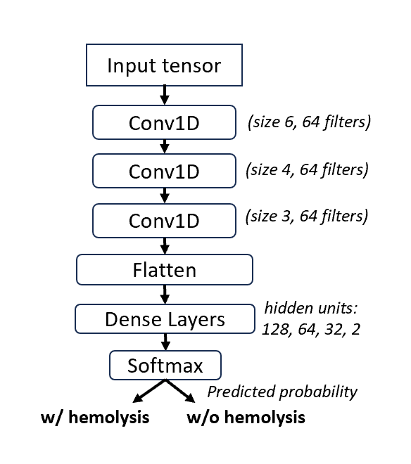

* Model 1
* img path: /models/m1_791_836_cnn_zs_5544/structure_img/M1_structure.PNG
* was plotted by ppt

  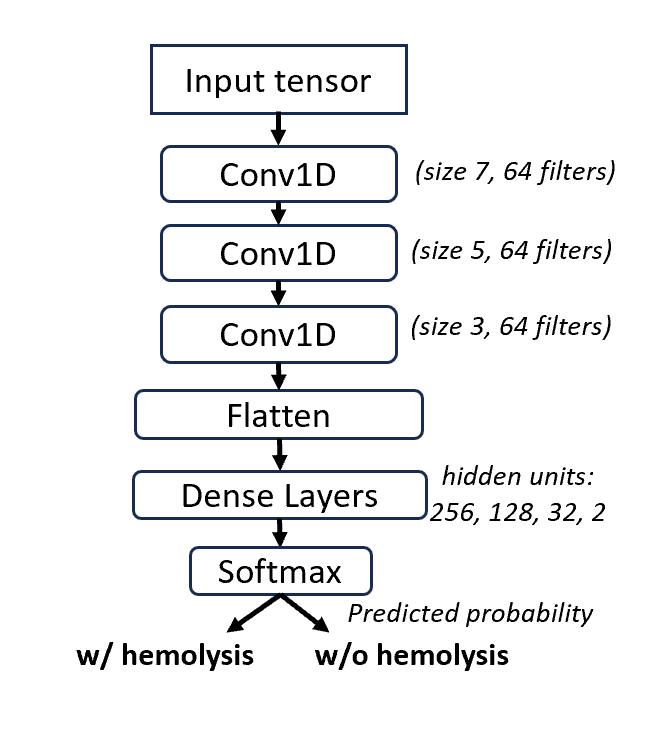

* Model 2
* img path: /models/m2_798_796_cnn2_zs_5545/structure_img/M2_structure.PNG
* was plotted by ppt

  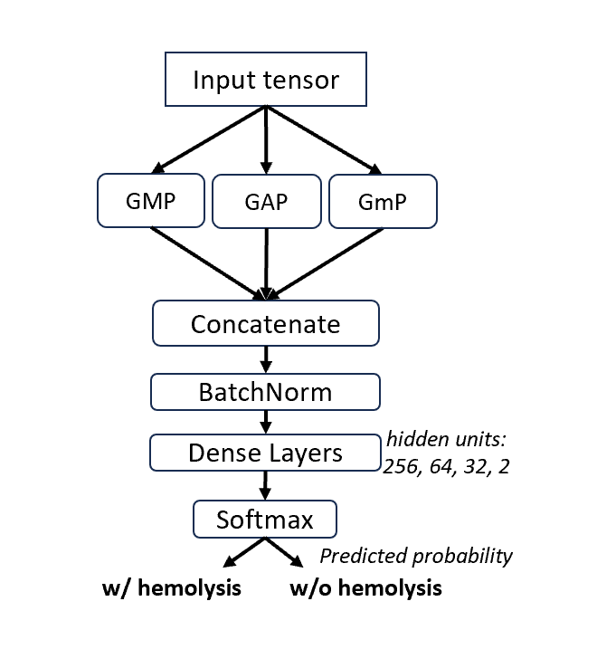

* Model 3
* img path: /models/m3_763_843_5950_3p1bn_ugml2std/structure_img/M3_structure.PNG
* was plotted by ppt

  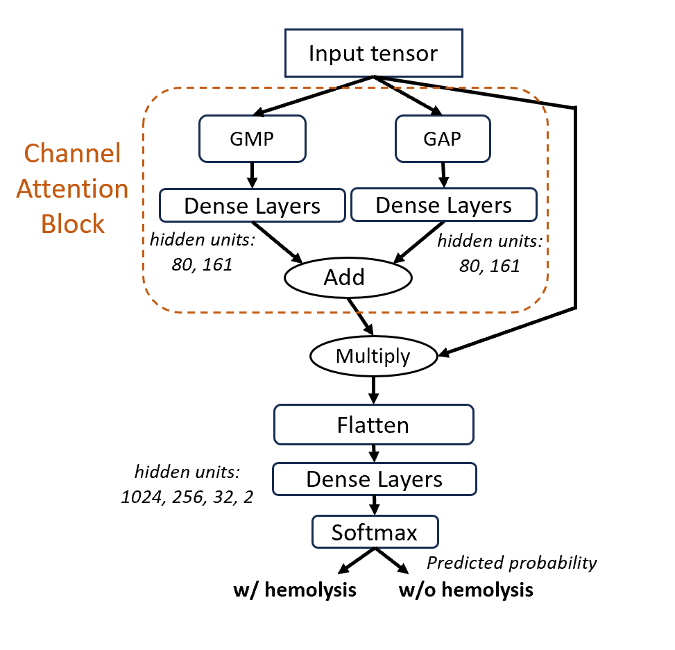

* Model 4
* img path: /models/m4_843_750_5041chatt_ugml2std/structure_img/M4_structure.PNG
* was plotted by ppt

---

  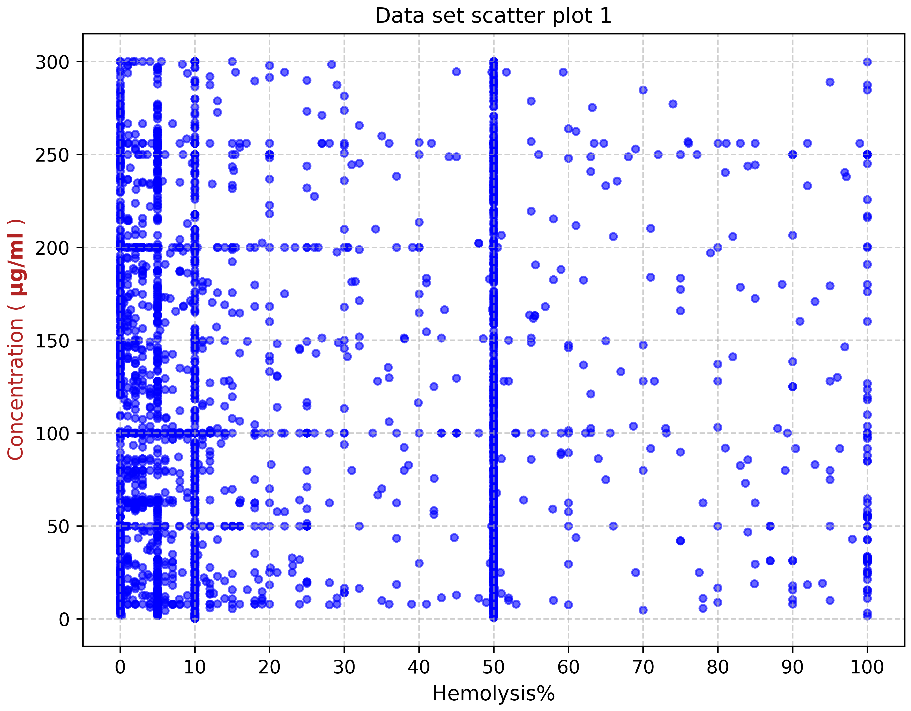

  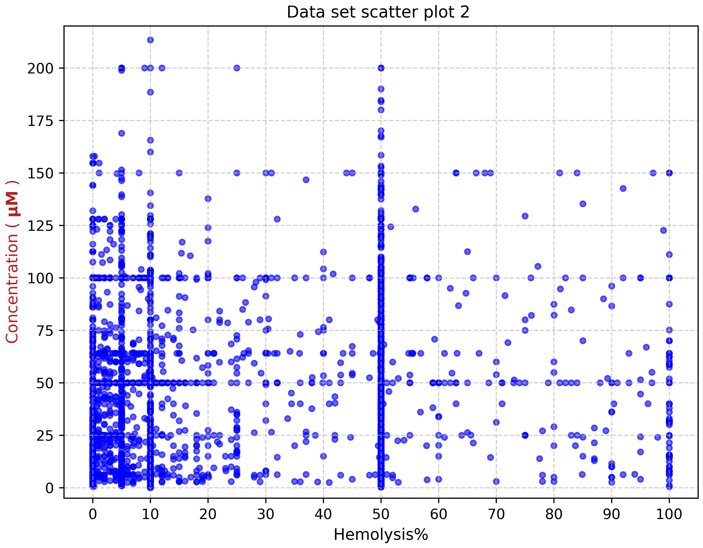

* Dataset distribution
* img path: /scatter/img_output/scatter_ugml.png
* was plotted by /scatter/data_scatter.py 
* note: /scatter/img_output/scatter_tif.tif was merged by scatter_ugml.png & scatter_uM.png 

---

  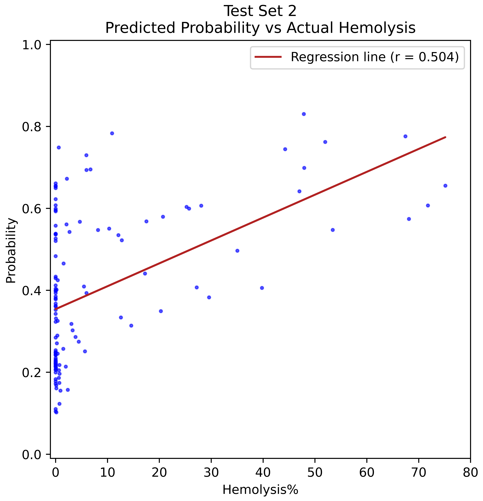

* test set 2 predicted score(0~1) vs actual hemolysis%  
(internal study, not in the thesis)
* img path: /t2_correlation/img_output/t2_corr_504.png
* was plotted by /t2_correlation/corplot.py

---

### Test set fasta file

* test set 1: /test_set/test_set1_173.fa

* test set 2 (sheep): /test_set/test_set2.fa saved in ELN (node/7928#comment-10895) instead of public Github

---

### Peptide property of Test Set
for thesis writing, this file saved Mass, Net charge, Hydrophobicity, Isoelectric point (pI) of peptide

* test set 1: not necessary

* test set 2 (sheep): /t2_property/t2_property.txt saved in ELN (node/7928#comment-10895) instead of public Github

---

